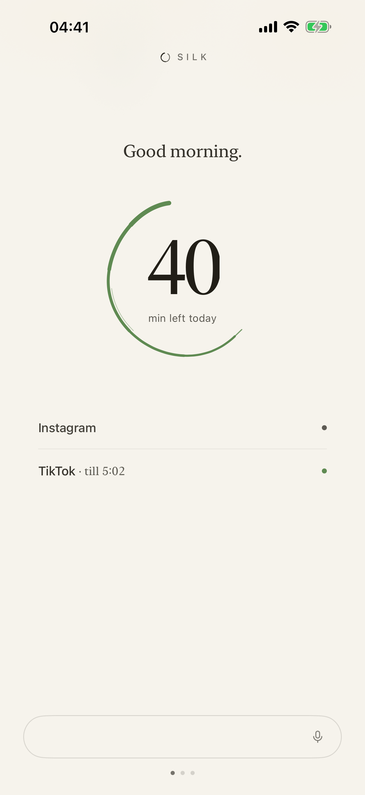
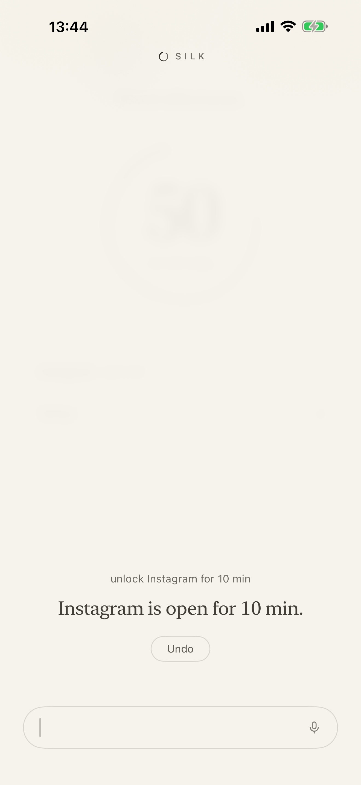
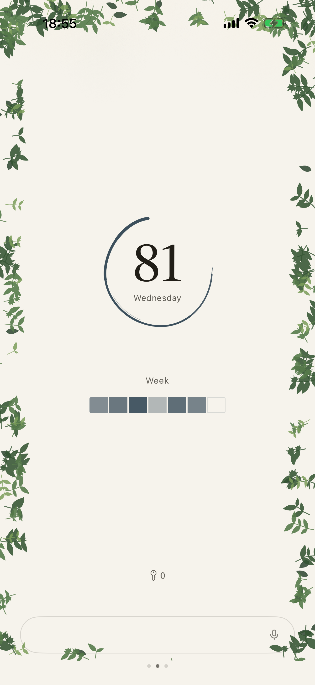

# Silk

An iOS Screen Time app. Your distracting apps live behind one door; you ask in your own words,
spend from one daily budget, and the door locks behind you. *The app you open instead.*

<p align="center">
  
  &nbsp;&nbsp;
  
  &nbsp;&nbsp;
  
</p>

## What it does

- **One door.** The apps you pick are shielded together and opened one grant at a time from a
  single daily budget. A per-app ceiling is a lid on that pool, never a second budget: one number
  on the screen, one pool to spend from.
- **Rules in plain language.** "Unlock Instagram for 10 min." A spend is a whole sentence — an
  opening verb, the app's exact name, and the minutes — and a fragment gets back the one sentence
  to write instead. Within budget the grant lands after a short wait that passes only while Silk
  is on screen; the balance reads back, the app opens, and the door locks again when the minutes
  run out. Refusals are four words and a time.
- **Tighten now, loosen tomorrow.** Anything that makes the day stricter takes effect at once.
  Anything that loosens it waits for tomorrow, unless the held rule's one button, "Apply now.", is
  tapped. Polarity is computed by state diff, never parsed from words.
- **A wall that fails closed.** Four re-lock layers stand behind every grant: a one-shot
  DeviceActivity schedule at expiry, a staggered backup two minutes later, a usage-threshold event
  on the door's own tokens, and a reconcile on every app foreground, shield render and shield tap.
  The ledger is the truth. If every layer fails, the door closes at the next wake: late, never never.
- **The model proposes; the validator disposes.** A deterministic parser answers first. An
  on-device model may widen what the grammar did not claim, and a deterministic validator has the
  last word on anything it proposes. No notification permission, ever.

## The rules the code enforces

The comments cite these by number.

1. **Spend by asking.** Within budget a grant is granted, the balance read back, the app opened —
   after a wait priced in seconds of watching, which passes only while Silk is on screen and stops
   the moment it is not. Nothing is debited, unshielded or armed until the wait is paid, so leaving
   costs nothing and the wall never comes down early. A spend is a whole sentence — an opening verb,
   the app name, and the minutes — and a fragment gets back the one sentence to write instead.
2. **Edges never yield.** Budget gone, a door's own ceiling spent, or down hours means no. Refusals
   are four words and a time, and they name the door when the door is what ran out — "0 left today."
   beside a hero reading 30 is a lie.
3. **Loosening waits for tomorrow** — unless the held rule's one button, "Apply now.", is tapped.
   Tightening is instant. Polarity is computed by state diff, never parsed from words.
4. **The wall fails closed.** The ledger is the truth; a dead extension closes doors late, never
   leaves them open. The model proposes; the validator disposes.
5. **No notification permission, ever.** Every word the app says comes from
   `SilkCore/Sources/SilkCore/Strings.swift` — 75 of them today, 65 constants and 10 that compose.
   The file is the vocabulary, and nothing outside it may speak.

## Architecture

| Path | What it is |
|---|---|
| `SilkCore/` | The spine as a pure-Swift package: parser, number tokenizer, clause index, validator, polarity engine, grant ledger, per-app ceilings, the wait's clock and price, the launch catalogue's data. `swift test` runs on macOS **and on Linux** — 1,051 tests across 191 suites (three generations of fuzz corpora, a seeded 20k-input fuzzer, the wait's frame-budget bounds, and the re-lock's lateness bounds), no simulator needed. The sources import Foundation and nothing else and carry no conditional compilation at all, which is what lets 1,050 of the repo's 1,187 cases answer in a container; CI's `spine-linux` job is what keeps that true. |
| `Silk/` | The app: Now, Mirror + Settings, the bar and its conversation, the compile pipeline, wall controller, the launch catalogue's one `UIApplication` call, the `Spend` App Intent, the on-device model widener. |
| `Shared/` | The App Group bridge (`SharedStore`) and the single wall (`Wall.reconcile()`), shared with all three extensions. |
| `SilkMonitor/` · `SilkShield/` · `SilkShieldAction/` | The Screen Time extensions: re-lock layers, the statement-only shield, the one OK button. |
| `project.yml` | XcodeGen spec — regenerate `Silk.xcodeproj` with `xcodegen generate`. All four bundle IDs, the App Group and the log subsystem derive from one setting, `SILK_BUNDLE_PREFIX`. |
| `SilkTests/` | The app's own logic, hosted by the app so it reaches `AppModel` without a simulator walk: the wait's state machine, its ledger transaction, undo on the far side of it, and the frame budget the mark's geometry and the landing are held to. |
| `SilkUITests/` | The simulator walks, including the one that captures the screenshots. |
| `scripts/ci.sh` · `.githooks/` | Every suite, and the pre-push hook that runs the cheap one. See **Tests**. |
| `silk-ds/` · `ds-bundle/` | The design language: warm paper, ink, the ensō, and a deliberately small vocabulary. |
| `assets/screenshots/` | Device captures, and the App Store set composed from them. |

## Build

```bash
brew install xcodegen
xcodegen generate
xcodebuild -project Silk.xcodeproj -scheme Silk \
  -destination 'generic/platform=iOS Simulator' CODE_SIGNING_ALLOWED=NO build
```

Before running on a device: `DEVELOPMENT_TEAM` is already set in `project.yml`, and development
signing needs nothing else — FamilyControls is available to every team for development.

## Tests

```bash
scripts/ci.sh                    # all three suites and the Release build, ~25 min
scripts/ci.sh spine              # SilkCore only, seconds, no simulator
scripts/ci.sh unit               # SilkTests only — the app's logic, ~1 min
scripts/ci.sh ui                 # SilkUITests only, ~5 min
scripts/ci.sh release            # Release compiles at all, ~4 min, no simulator
```

`cd SilkCore && swift test` is the spine on its own, and it answers on Linux as well as on macOS.

`.github/workflows/ci.yml` runs the same lanes on every pull request and every push to `main`.
That is the gate; a red PR is the answer.

The hook is the fast half. Turn it on once per clone:

```bash
git config core.hooksPath .githooks
```

`.githooks/pre-push` then runs the spine only. `SILK_RUN_UI=1 git push` runs the simulator too;
`git push --no-verify` skips the hook entirely.

## Status

1.0.0 is built and installed on a device. It is not on the App Store yet: the Family Controls
distribution entitlement is granted, and distribution waits on the Apple Distribution certificate.

## License

All rights reserved. The source is published for reference; see [LICENSE](LICENSE).
